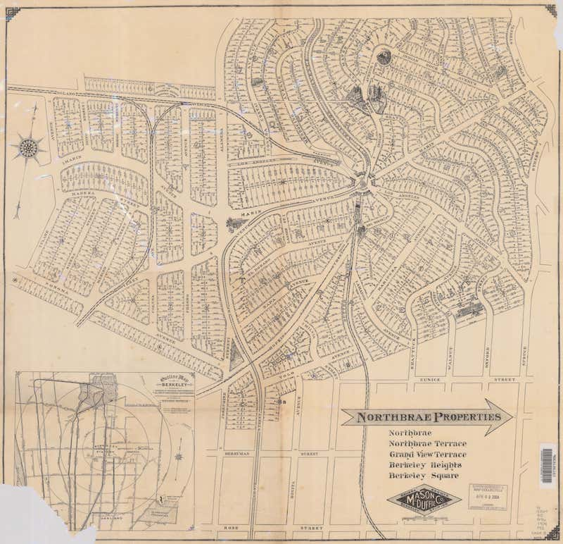
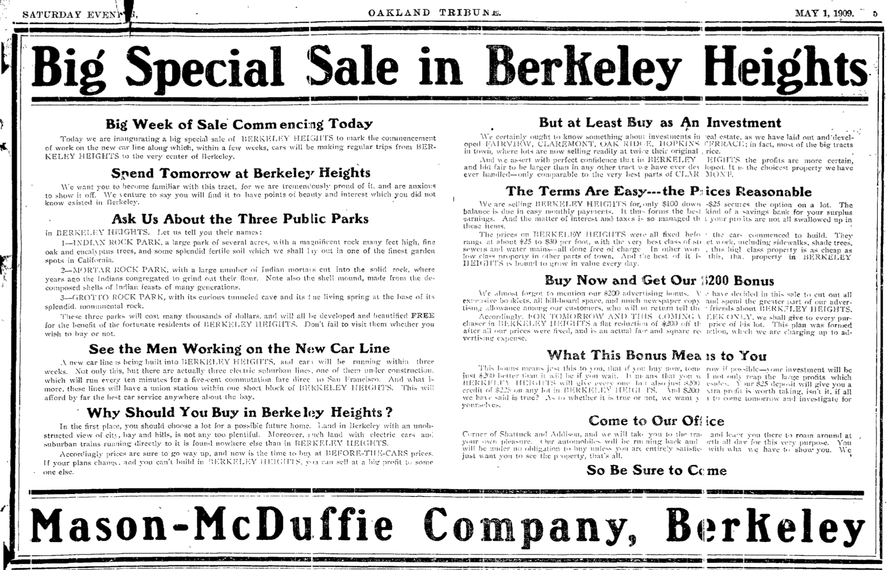
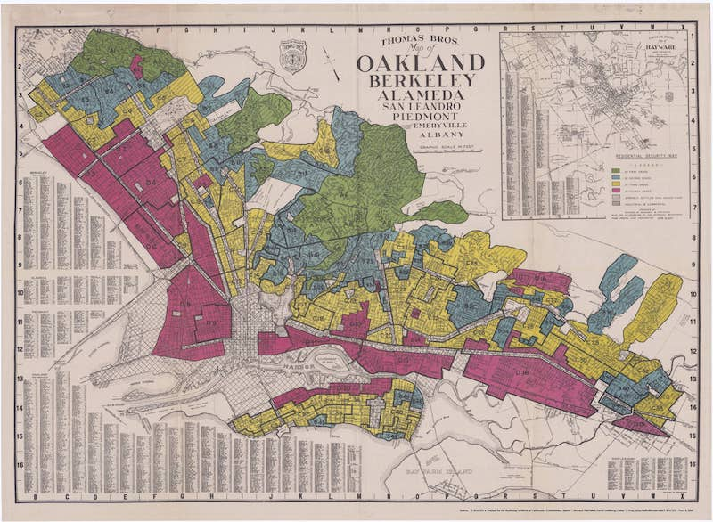

The East Bay, including Berkeley, is traditional
[Lisjan Ohlone land](https://sogoreate-landtrust.com/shuumi-land-tax/#). Following
the
[Spanish missions](https://en.wikipedia.org/wiki/Spanish_missions_in_California#cite_note-4),
which stole Ohlone land and enslaved the Ohlone people, the land on
which Berkeley stands was
[granted to Spanish Army sergeant Don Luís María Peralta](https://en.wikipedia.org/wiki/Rancho_San_Antonio_(Peralta))
in 1820, and then subsequently subdivided and sold off.

The map below from 1909 shows the Northbrae Properties subdivision in
the Berkeley
Hills. ([source](https://digicoll.lib.berkeley.edu/record/58662))
This subdivision was one of a number of tracts of land in the Bay Area bought and developed as a set
of private residential parks, and marketed and sold by the
[Mason-McDuffie Company](https://oac.cdlib.org/findaid/ark:/13030/tf800006jp/admin/#bioghist-1.3.4).

These developments were conceived through the vision of
[Duncan McDuffie](https://en.wikipedia.org/wiki/Duncan_McDuffie), who
helped establish the California State Parks and the East Bay Regional
Park systems, and was twice president of the Sierra Club. McDuffie's
companies developed substantial parts of the East Bay and San
Francisco.

However, in line with standard practice at the time, homes in these
developments were sold only to white buyers, enforced as part of the
sales process through restrictive covenants. The Mason-McDuffie Co. covenant states as
its final condition: "if prior to the first day of January 1930 any
person of African or Mongolian descent shall be allowed to purchase or
lease said property or any part thereof, then this conveyance shall be
and become void...." [3]. Covenants also forebade the construction of
anything other than single-family properties on Mason-McDuffie
residential developments.

Such covenants were limited in term, and could not control
what happened outside the boundaries of private residential
developments. Thus public zoning ordinances, first deployed in Los Angeles,
were adopted by Berkeley to help maintain racial residential
segregation in the face of these and other limitations of restrictive
covenants (see [1]).

As president of the Berkeley Civic Arts Commission, created to pursue
city planning activities, McDuffie spearheaded the creation of
Berkeley's first districting ordinance on March 10, 1916 [1]. While
based on LA's 1908 law, the Berkeley ordinance also pioneered the
creation of zones restricted to single family residences. The zoning
ordinance was rapidly deployed to close down or prevent the
establishment of East Asian and Black businesses, and was used to
reinforce racial segregation.

Marc Weiss writes in "Urban Land Developers and the Origins of Zoning
Laws: The Case of Berkeley" [1]: "That the focus of Berkeley's zoning
law should be on racial restrictions is not
surprising given the anti-Chinese origins of zoning in
California... In 1925 and 1926 the California Real Estate magazine 
reported that one of the most popular examples of 'service rendered'
by a local real estate board 'to members and to the community at
large' was the attempt by the Berkeley Realty Board, a strong
supporter of city planning and zoning, 'to organize a district of some
twenty blocks under the covenant plan as protection against invasion
of Negroes and Asiatics.'"

The result of restricted covenants and zoning laws was that “almost
all Asian and Black Berkeleyans lived south of Dwight Way and west of
Grove Street,” Charles Wollenberg writes in _Berkeley: A City in
History._

In 1933, Franklin Roosevelt created the Home Owners’ Loan Corporation
(HOLC) to offer affordable mortgages as part of the New Deal. The HOLC
created "security maps" to help banks assess the risks of lending,
based on the location of the home. These maps divided cities into
grades from "A" (green, the best areas) through to "D" (red, hazardous
areas). These maps were used to legally discriminate against ethnic
and racial minorities, a practice known as ["redlining"](https://www.npr.org/2017/05/03/526655831/a-forgotten-history-of-how-the-u-s-government-segregated-america).

Loans were denied to people in non-white communities since their neighborhoods were
listed as grades C and D, and thus such loans were classified as being at a high risk of default. The Federal Housing Administration (FHA) created an _Underwriting Manual_ which said that "incompatible racial groups should not be permitted to live in the same communities," since based on the logic of the HOLC's classification system, "infiltration" of non-white homeowners would result in down-grading of the area.  This prevented loans to non-white people wanting to buy in A or B zones from being insured, effectively excluding them from these zones. Further, HOLC/FHA borrowers [could not get aid or a mortgage guarantee](http://www.redliningvirginia.org/exhibits/show/the-national-story/restrictive-covenants) without having a race-restrictive covenant on their home or covering their neighborhood, perpetuating housing segregation.

The 1937 security map for Oakland and Berkeley is shown
below. (source: [6], [full size](images/oakland-berkeley-redline.jpg))

The enforcement of restrictive covenants and zoning laws was so effective that the
North Berkeley Hills area was listed as security grade "Green". In the
[accompanying description for area A-1](images/berkeley-a1.pdf), the zone in which the Berkeley
Heights development is listed, the clarifying remarks (written on
August 26, 1937) read as follows:
"This section is known as Arlington Heights, Thousand Oaks Heights and
North Cragmont and is one of the most active residential districts of
the East Bay Area. A great amount of federal housing money has been
used in financing homes in this area... Zoned first residential,
single family, deed restrictions prohibit Asiatics and Negroes." The
form notes that no Black people live in this zone.

While the Supreme Court ruled in 1948 that restrictive covenants were
unenforceable, redlining continued. In January of 1963 the Berkeley
City Council "passed an anti-segregation law that included criminal
penalties for those guilty of housing discrimination – one of the
first efforts of its kind. However, the opposition was
tremendous. Within months, residents opposed to the new law had
gathered enough signatures to place a referendum on the April
ballot. Tensions ran so high that three Berkeley High students set a
cross on fire on the lawn of Fred Stripps, a liberal mayoral candidate
who opposed the referendum. There was a record turnout of voters — one
account said 82% of Berkeley voters went to the polls  — and the law
was repealed. The fair housing law was rescinded on the grounds that
the anti-segregation law violated basic property rights and had
communist influences, according to Wollenberg... [who] writes
that one supporter of the referendum said that it was 'A plot to
Congo-lize our city.' A Thousand Oaks realtor said, 'The day I have to
sell to a Negro and ruin this fine district, I’ll close up and get out
of the real estate business.'" [4] 

While the Fair Housing Act (Title VII of the Civil Rights Act of 1968)
outlaws housing discrimination, the effects of housing discrimination
are still visible: "Those areas that were labeled desirable on
the HOLC maps remain the most sought-after real estate in Berkeley,
the wealthiest, and the whitest. Berkeley’s distinctive distribution
of real estate value, in part created through the systematically
racist local and national housing policy in the 20th century, is much
the same today." [4]

The history of this discrimination is also visible in the stone pillars
that mark out the whites-only Mason-McDuffie developments. [5]

What you can do:

- Pay reparations by donating
[Shuumi land tax](https://sogoreate-landtrust.org/) annually to the
Lisjan Ohlone people still living in the East Bay [7].
- Read the
[Remedies, Solutions, and Targets](https://belonging.berkeley.edu/racial-segregation-san-francisco-bay-area-part-5)
section in the
[Othering and Belonging Institute](https://belonging.berkeley.edu/)'s
study on
[Racial Segregation in the San Francisco Bay Area](https://belonging.berkeley.edu/segregationinthebay),
and learn about the importance of affordable housing, inclusionary
zoning, and rent control to remedy Berkeley's history of racial
discrimination and segregation.

## References and further reading

- [0]
[Living on Ohlone land](https://m.eastbayexpress.com/oakland/living-on-ohlone-land/Content?oid=16512595&showFullText=true). East
Bay Express, May 30, 2018.
- [1] Weiss, M. A. (1986).
[Urban Land Developers and the Origins of Zoning Laws: The Case of Berkeley](https://escholarship.org/uc/item/26b8d8zh).
Berkeley Planning Journal, 3(1).
- [2] Moore, E. et al
(2019). [Roots, Race and Place: A History of Racially Exclusionary Housing in the San Francisco Bay Area](https://belonging.berkeley.edu/rootsraceplace).
Haas Institute, UC Berkeley.
- [3] Lorey,
M. T. (2013). [A History of Residential Segregation in Berkeley, California, 1878-1960](http://www.schoolinfosystem.org/pdf/2014/06/04SegregationinCA24-2.pdf).
Concord Review, 24(2).
- [4] Barber,
J. (2018). [Redlining: The history of Berkeley’s segregated neighborhoods](https://www.berkeleyside.com/2018/09/20/redlining-the-history-of-berkeleys-segregated-neighborhoods).
Berkeleyside, September 20, 2018.
- [5] Gammon,
R. (2017). [Hidden Monuments to Racism](https://www.eastbayexpress.com/oakland/hidden-monuments-to-racism/Content?oid=9251259). East
Bay Express, September 20, 2017.
- [6] [Testbed for the Redlining Archive of California's Exclusionary Spaces](http://salt.umd.edu/T-RACES/). See also the University of Richmond's [interactive redlining map of the USA](https://dsl.richmond.edu/panorama/redlining/#loc=5/39.1/-94.58).
- [7]
[Native American 'land taxes': a step on the roadmap for reparations](https://www.theguardian.com/us-news/2019/dec/31/native-american-land-taxes-reparations). The
Guardian, December 31, 2019.

With thanks to [Darrell Owens](https://twitter.com/IDoTheThinking) for
his advocacy work on housing discrimination in Berkeley, and [Corrina
Gould](https://womensearthalliance.org/weawomen/2019-us-accelerator/corrina-gould/), Traditional Spokesperson and Tribal Chair of the Confederated
Villages of Lisjan.
